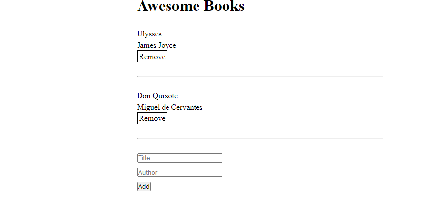

# Awesome Books

> One paragraph statement about the project.

Additional description about the project and its features.

## Built With

- HTML5
- CSS3
- Javascript

## Live Demo

[Live Demo Link](https://nuri1977.github.io/awesome-books/)

## Getting Started

** git clone https://github.com/Nuri1977/awesome-books.git**
** git pull origin **

To get a local copy up and running follow these simple example steps.

## Authors

👤 **Authors**

  ## Author1

  👤 **Nuri Lacka**

- GitHub: [@Nuri1977](https://github.com/Nuri1977)
- Twitter: [@Lackanuri](https://twitter.com/LackaNuri)
- LinkedIn: [@nurilacka](https://www.linkedin.com/in/nuri-lacka-7141b01ba/)

## Author2

👤 **Dejan Vujovic**

- Github : [@VuDej](https://github.com/VuDej)
- Twitter: [@DejanVuj](https://twitter.com/DejanVuj)
- LinkdIn : [@Dejan-Vujovic](https://www.linkedin.com/in/dejan-vujovic-5a0672225/)

## 🤝 Contributing

Contributions, issues, and feature requests are welcome!

Feel free to check the [issues page](../../issues/).

## Show your support

Give a ⭐️ if you like this project!

## Acknowledgments

- Hat tip to anyone whose code was used
- Inspiration
- etc

## 📝 License

This project is [MIT](./MIT.md) licensed.